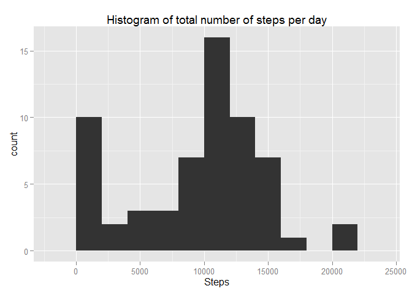
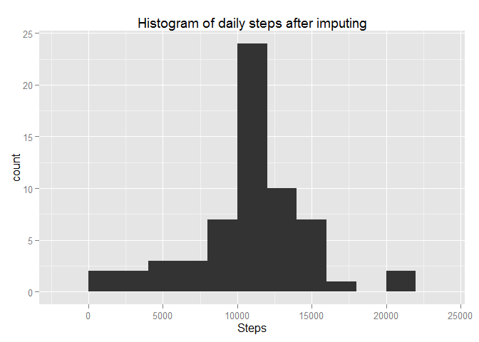
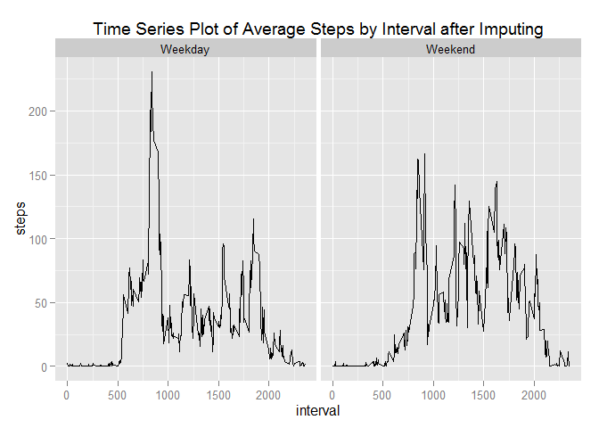

# Reproducible Research: Peer Assessment 1


## Loading and preprocessing the data

Downloading the dataset archive, unpack it, read csv file and process the date column


```r
filePath <- "activity.csv"
arcPath <- "activity.zip"
if (!file.exists(filePath)) {
    if (!file.exists(arcPath)) {
        fileURL <- "https://d396qusza40orc.cloudfront.net/repdata%2Fdata%2Factivity.zip"
        message("Downloading data set archive...")
        download.file(url = fileURL, destfile = arcPath)
    }
	message("Extracting data set file from the archive...")
	unzip(zipfile = arcPath)
}
activity <- read.csv(filePath)

Sys.setlocale("LC_TIME", "English")
```

```
## [1] "English_United States.1252"
```

```r
Sys.setenv(tz = "GMT")
activity$date <- as.Date(activity$date, tz = "GMT")
```

```
## Warning in strptime(xx, f <- "%Y-%m-%d", tz = "GMT"): unable to identify current timezone 'B':
## please set environment variable 'TZ'
```

```
## Warning in strptime(xx, f <- "%Y-%m-%d", tz = "GMT"): unknown timezone
## 'localtime'
```

## What is mean total number of steps taken per day?

Making a histogram of the total number of steps taken each day


```r
library(ggplot2)
total_steps_per_day <- aggregate(x = activity$steps, by = list(activity$date),
                                 FUN = sum, na.rm = TRUE)
names(total_steps_per_day) <- c("date", "steps")
histplot <- ggplot(total_steps_per_day, aes(x = steps)) +
            ggtitle("Histogram of total number of steps per day") +
            xlab("Steps") +
            geom_histogram(binwidth = 2000)
histplot
```

 

Calculating the mean total number of steps taken per day

```r
mean(total_steps_per_day$steps, na.rm = TRUE)
```

```
## [1] 9354.23
```

and median total number of steps taken per day


```r
median(total_steps_per_day$steps, na.rm = TRUE)
```

```
## [1] 10395
```

## What is the average daily activity pattern?

Making a time series plot of 5-minute interval and the average number of steps taken, averaged across all days


```r
average_steps_by_interval <- aggregate(x = activity$steps, by = list(activity$interval),
                                       FUN = mean, na.rm = TRUE)
names(average_steps_by_interval) <- c("interval", "steps")

avg_step_line <- ggplot(average_steps_by_interval, aes(interval, steps)) +
                 ggtitle("Time Series Plot of Average Steps by Interval") +
                 geom_line()
avg_step_line
```

 

Which 5-minute interval, on average across all the days in the dataset, contains the maximum number of steps?


```r
average_steps_by_interval[which.max(average_steps_by_interval$steps), c("interval")]
```

```
## [1] 835
```

## Imputing missing values

Calculating the total number of missing values in the dataset


```r
nrow(activity[is.na(activity$steps),])
```

```
## [1] 2304
```

Creating a new dataset that is equal to the original dataset but with the missing data filled in


```r
activity_imputed <- merge(x = activity, y = average_steps_by_interval, by = "interval",
                          all.x = TRUE)
activity_imputed[is.na(activity_imputed$steps.x), c("steps.x")] <-
                activity_imputed[is.na(activity_imputed$steps.x), c("steps.y")]
```

Processing a new dataset


```r
activity_imputed$date <- as.Date(activity_imputed$date)
activity_imputed$date.x <- NULL
activity_imputed$Group.1 <- NULL
activity_imputed$steps <- activity_imputed$steps.x
activity_imputed$steps.x <- NULL
activity_imputed$steps.y <- NULL
```

Making a histogram of the total number of steps taken each day


```r
total_steps_per_day_new <- aggregate(x = activity_imputed$steps, by = list(activity_imputed$date),
                                 FUN = sum, na.rm = TRUE)
names(total_steps_per_day_new) <- c("date", "steps")
histplot <- ggplot(total_steps_per_day_new, aes(x = steps)) +
            ggtitle("Histogram of daily steps after imputing") +
            xlab("Steps") +
            geom_histogram(binwidth = 2000)
histplot 
```

 

Mean total number of steps taken per day


```r
mean(total_steps_per_day_new$steps, na.rm = TRUE)
```

```
## [1] 10766.19
```

Median total number of steps taken per day


```r
median(total_steps_per_day_new$steps, na.rm = TRUE)
```

```
## [1] 10766.19
```

## Are there differences in activity patterns between weekdays and weekends?

Creating a new factor variable in the dataset with two levels – “weekday” and “weekend” indicating whether a given date is a weekday or weekend day


```r
activity_imputed$weekday <- as.factor(ifelse(weekdays(activity_imputed$date) %in%
                                      c("Saturday", "Sunday"), "Weekend", "Weekday"))

average_steps_by_interval_and_weekday <- aggregate(x = activity_imputed$steps, 
                                                   by = list(activity_imputed$interval, activity_imputed$weekday),
                                                   FUN = mean, na.rm = TRUE)
names(average_steps_by_interval_and_weekday) <- c("interval", "weekday", "steps")
```

Making a panel plot containing a time series plot of the 5-minute interval and the average number of steps taken, averaged
across all weekday days or weekend days


```r
avg_step_line <- ggplot(average_steps_by_interval_and_weekday, aes(interval, steps)) +
                 ggtitle("Time Series Plot of Average Steps by Interval after Imputing") +
                 geom_line() +
                 facet_grid(. ~ weekday)
avg_step_line
```

 
